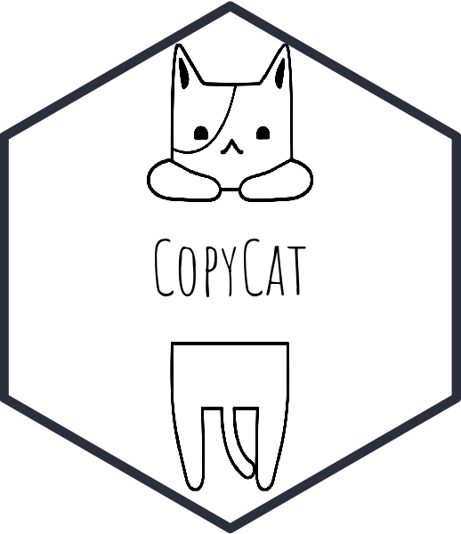

<!-- README.md is generated from README.Rmd. Please edit that file -->

```{r, include = FALSE}
knitr::opts_chunk$set(
  collapse = TRUE,
  comment = "#>",
  fig.path = "man/figures/",
  out.width = "100%"
)

library(tidyverse)

```

# CopyCat 

<!-- badges: start -->

[](https://github.com/edgar-treischl/CopyCat/actions)
<!-- badges: end -->

CopyCat is a small package to copy, paste, and view code snippets. All provided code snippets are minimal examples based on code that runs with implemented data, which helps R learner to see how the code works. CopyCat uses three different code sources. First, CopyCat comes with a small data frame that includes code snippets from the cheat sheets of the `ggplot2` and the `tidyr` package. Of course, you can use your own code snippets as a data source as well. Second, CopyCat can fetch and copy code that lives on Github. Ultimately, CopyCat searches also within the R help files and vignettes for code that illustrates how a function works. Thus, CopyCat was built as a personal package for the lazy cats, but it may help new R users to manage code snippets. 


## Installation

Install CopyCat from my github account with:

```{r, eval=FALSE}
devtools::install_github("edgar-treischl/CopyCat",
                         build_vignettes = TRUE)
```

## Explore Copycat with the addin

CopyCat comes with a small data set (`CopyCatCode`) that contains minimal examples of several cheat sheets that run without further ado. The `CopyCatCode` data provides the package name, the function, and the code of the minimal example. You can inspect the data and copy code with the `copycat_addin()`. The adding shows all package names and code for the function within the viewer. Just pick one of the function and press *insert code*. RStudio will insert the code snippet in your script.

```{r, eval=FALSE}
## load library and provide a data frame 
copycat::copycat_addin()
```

```{r, out.width='60%', echo=FALSE, fig.align='center'}
knitr::include_graphics('man/figures/addin.png')
```

Of course, you do not have to use the adding to search and copy the code. Let's say you cannot remember how `pivot_longer` from the `tidyr` package works. Just search for the corresponding code snippet via the `copycat()` function, it searches for the code snippet and saves the returned code to your clipboard. To see code that is actually returned, use the corresponding `copycat_code()` function.

```{r, eval=TRUE}
library(copycat)
# copycat("pivot_longer") saves the returned code to the clipboad
#>[1] "🐈 Your code: relig_income %>% tidyr::pivot_longer(!religion, names_to = #>'income', values_to = 'count')"
# copycat_code() let us inspect what the function returned 
copycat_code("pivot_longer")

```

The code is based on implemented data -- as all examples listed in CopyCat -- you can see how it works just by pasting it into your console. Alternatively, set the `run` option to `TRUE` and `copycat()` sends the code to your console.

```{r, eval=FALSE}
copycat("pivot_longer", run = T )
```

See the vignette for further examples how to use CopyCat with Github, help or vignette files.
