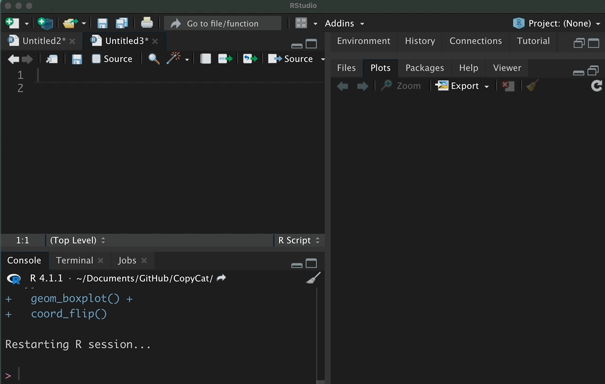
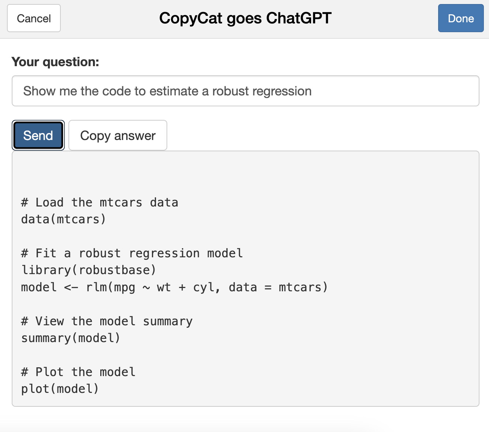

<!-- README.md is generated from README.Rmd. Please edit that file -->

```{r, include = FALSE}
knitr::opts_chunk$set(
  collapse = TRUE,
  comment = "#>",
  fig.path = "man/figures/",
  out.width = "100%"
)

library(tidyverse)

```

# CopyCat 

<!-- badges: start -->

[](https://github.com/edgar-treischl/CopyCat/actions/workflows/R-CMD-check.yaml)

<!-- badges: end -->

CopyCat is a small package to copy, paste, and manage code snippets. CopyCat comes with code snippets (minimal examples) that run with implemented data. In addition, CopyCat provides an interface to ask ChatGPT questions about R. CopyCat was built as a personal package for the lazy cats, but it may help (new) R users to learn R.

## Installation

Install CopyCat from my GitHub account with:

```{r, eval=FALSE}
devtools::install_github("edgar-treischl/CopyCat",
                         build_vignettes = TRUE)
```

## Explore the Copycat code snippets

CopyCat comes with a data (`CopyCatCode`) that includes code snippets from the cheat sheets of the `ggplot2`, `tidyr`, and more packages from the `tidyverse`. The data include the package name, the function name, and the code of the minimal example.

```{r, eval=FALSE, include=FALSE}
dplyr::distinct(CopyCatCode, package)
```

Copy a code snippet with the `copycat_addin()` which runs a graphical interface. Pick a function and press the *insert code* button. RStudio inserts the code for you. The gif shows how the RStudio addin works.

```{r, out.width='90%', echo=FALSE, fig.align='center'}

```

## Get help from ChatGTP

The package has a built-interface to get help from ChatGTP. To connect with ChatGTP, go to [openai](https://openai.com/){.uri}, create an account and generate an API key. Next create an object called (`gtp_api`) for your API key or use the `keyring` package to save the key savely.

```{r, eval=FALSE}
#SET API Key as gtp_api
gtp_api <- "your-key"
#Or store it with keyring
keyring::key_set("gtp_api")
```

After your API key is set, you can sent your questions via the `ask_gpt()` funciton. I primed ChatGTP to be your R tutor. Thus, ChatGTP will returns solution with R and returns them via your console. For example:

```{r}
#Ask GPT for help
library(copycat)
ask_gpt(message = "How do I estimate a robust regression?")
```


Consider the help files to adjust the text `model`, the number of maximal tokens (`maxtoken`), the temperature (`tempvalue`) and further ChatGTP paramters. Moreover, there is no need to remember the function and options. Just use the AskGTP addin as the next illustration shows. It's a small interface to send message to Chat GTP.

```{r, out.width='60%', echo=FALSE, fig.align='center'}

```

As outlined, I started to build CopyCat as a personal package. It provides more features but some of its features are still experimental stage. For example, use the `copycat_random()` in your start up to explore functions from packages that have been installed on your computer. It randomly picks a function example that is installed on your computer.

```{r, eval=FALSE}
#Get the code example of a random function from an installed package
copycat_random()
```


```{r}
#Package and function of the day: concaveman::concaveman 

library(concaveman)
#concaveman: A very fast 2D concave hull algorithm.
#Examples:

data(points)
polygons <- concaveman(points)
plot(points)
plot(polygons, add = TRUE)
```


Inspect the *Get started* vignette for more information.


