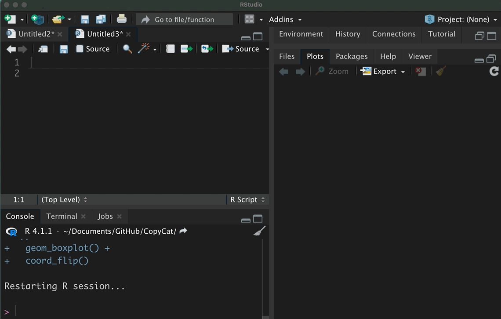

<!-- README.md is generated from README.Rmd. Please edit that file -->

# CopyCat 

<!-- badges: start -->

[](https://github.com/edgar-treischl/CopyCat/actions)
<!-- badges: end -->

CopyCat is a small package to copy, paste, and manage code snippets.
CopyCat comes with code snippets (minimal examples) that run with
implemented data. CopyCat was built as a personal package for the lazy
cats, but it may help (new) R users to manage code snippets.

## Installation

Install CopyCat from my github account with:

``` r
devtools::install_github("edgar-treischl/CopyCat",
                         build_vignettes = TRUE)
```

## Explore Copycat with the addin

Use the addin to get an idea what Copycat does. CopyCat comes with a
data (`CopyCatCode`) that includes code snippets from the cheat sheets
of the `ggplot2` and the `tidyr` package (and some more).

The data include the package name, the function name, and the code of
the minimal example. Inspect the data and copy a code with the
`copycat_addin()` which runs a graphical interface to examine the data
within the viewer. Pick a function and press the *insert code* button.
RStudio inserts the code for you.

``` r
## load library and provide a data frame 
copycat::copycat_addin()
```



So, you do not have to use the addin. Let’s say you cannot remember how
`pivot_longer` from the `tidyr` package works. Just search for the
corresponding code snippet via the `copycat()` function. It look up the
code snippet and saves the returned code to your clipboard. To inspect
the code that is actually returned, the `copycat_code()` function might
be handy.

``` r
library(copycat)
# copycat("pivot_longer") saves the returned code to the clipboard
#"🐱 copied that!"
# copycat_code() let you inspect what the function returned 
copycat_code("pivot_longer")
#> [1] "🐈 Your code: pivot_longer(table4a, cols = 2:3, names_to =\"year\",\r\n             values_to = \"cases\")"
```

Overall, CopyCat has three different code sources. First, CopyCat comes
with data from the cheat sheets. Of course, you can use your own code
snippets as well. Second, CopyCat can also fetch and copy code for you
that lives on Github. Ultimately, CopyCat searches also within the R
help files and vignettes for code that illustrates how a function works.
See the vignette for further examples how to use CopyCat with Github,
help or vignette files.
