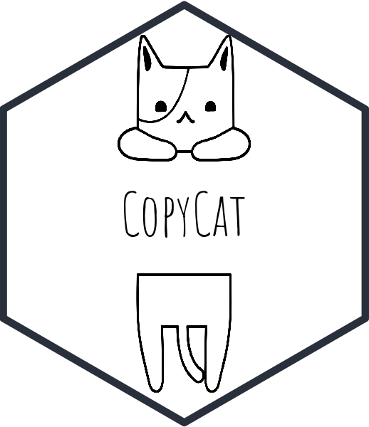
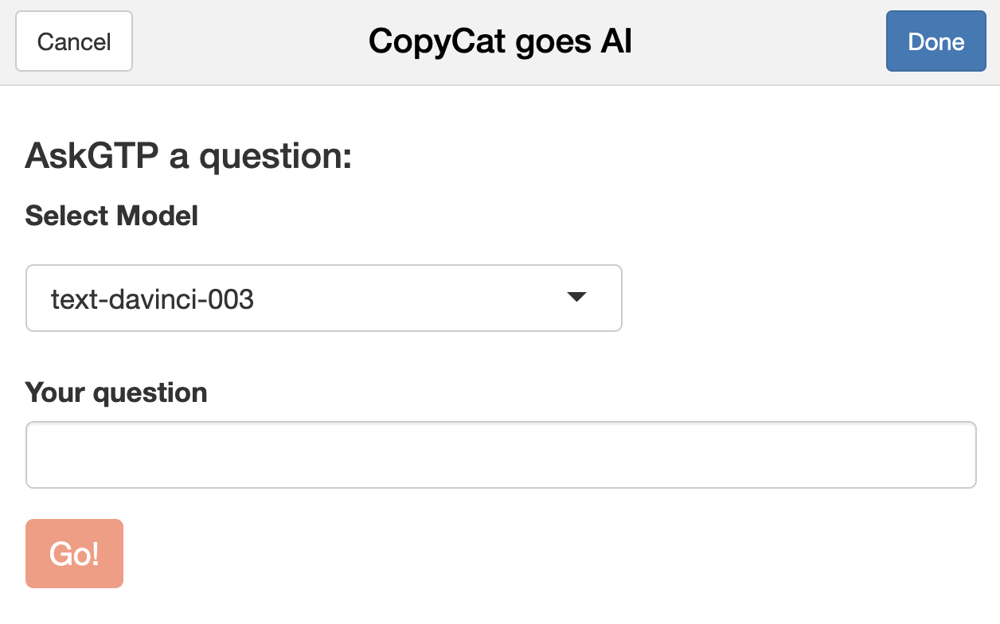
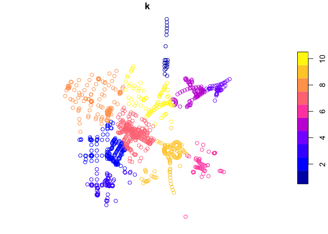

<!-- README.md is generated from README.Rmd. Please edit that file -->

# CopyCat 

<!-- badges: start -->

[](https://github.com/edgar-treischl/CopyCat/actions/workflows/R-CMD-check.yaml)

<!-- badges: end -->

CopyCat is a small package to copy, paste, and manage code snippets.
CopyCat comes with code snippets (minimal examples) that run with
implemented data. In addition, CopyCat provides an interface to ask
ChatGPT questions about R. CopyCat was built as a personal package for
the lazy cats, but it may help (new) R users to learn R.

## Installation

Install CopyCat from my GitHub account with:

``` r
devtools::install_github("edgar-treischl/CopyCat",
                         build_vignettes = TRUE)
```

## Explore the Copycat code snippets

CopyCat comes with a data (`CopyCatCode`) that includes code snippets
from the cheat sheets of the `ggplot2`, `tidyr`, and more packages from
the `tidyverse`. The data include the package name, the function name,
and the code of the minimal example.

Copy a code snippet with the `copycat_addin()` which runs a graphical
interface. Pick a function and press the *insert code* button. RStudio
inserts the code for you. The gif shows how the RStudio addin works.


## Get help from ChatGPT

The package has a built-interface to get help from ChatGPT. To connect
with ChatGPT, go to
<a href="https://openai.com/" class="uri">openai</a>, create an account
and generate an API key. Next create an object called (`gtp_api`) for
your API key or use the `keyring` package to save the key savely.

``` r
#SET API Key as gtp_api
gtp_api <- "your-key"
#Or store it with keyring
keyring::key_set("gtp_api")
```

After your API key is set, you can sent your questions via the
`ask_gpt()` function. I primed ChatGPT to be your R tutor. Thus, ChatGPT
will return a solution with R and via the console. For example:

``` r
#Ask GPT for help
library(copycat)
ask_gpt(message = "How do I estimate a robust regression?")
#> 
#> 
#> Estimating a robust regression in R and RStudio is a relatively straightforward process. To demonstrate, we will use the mtcars data set.
#> 
#> First, we will load the data set into RStudio.
#> 
#> ```
#> data(mtcars)
#> ```
#> 
#> Next, we will create a robust regression model using the lmrob() function from the robustbase package.
#> 
#> ```
#> library(robustbase)
#> model <- lmrob(mpg ~ wt + cyl, data = mtcars)
#> ```
#> 
#> Finally, we will print the summary of the model.
#> 
#> ```
#> summary(model)
#> ```
#> 
#> The output of the summary() function will provide us with the estimated coefficients, standard errors, t-values, and p-values for the model.
```

Consider the help files to adjust the text `model`, the number of
maximal tokens (`maxtoken`), the temperature (`tempvalue`) and further
ChatGPT parameters. Moreover, there is no need to remember the function
and options. Just use the AskGPT addin as the next illustration shows.
It’s a small interface to send messages to ChatGPT.



As outlined, I started to build CopyCat as a personal package. It
provides more features but some of its features are still experimental
stage. For example, use the `copycat_random()` in your start up to
explore functions from packages that have been installed on your
computer. It randomly picks a example function that is installed on your
computer.

``` r
#Get the code example of a random function from an installed package
copycat_random()
```

``` r
#Package and function of the day: concaveman::concaveman 

library(concaveman)
#concaveman: A very fast 2D concave hull algorithm.
#Examples:

data(points)
polygons <- concaveman(points)
plot(points)
plot(polygons, add = TRUE)
```



Inspect the *Get started* vignette for more information.
